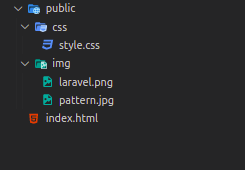
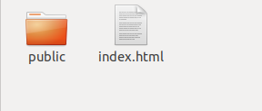
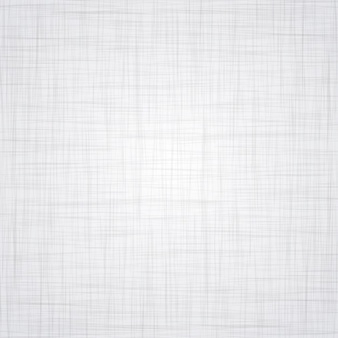
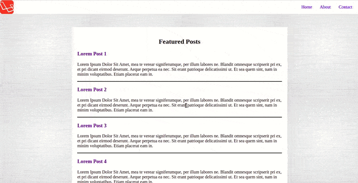

# layouting-html-css
Target
Membuat layout HTML dengan CSS

## Petunjuk Pengerjaan
Ikutilah langkah-langkah pengerjaan di bawah ini:‌
1. Membuat File HTML 
   Buatlah sebuah file HTML bernama index.html. Gunakan code yang sudah disediakan di bawah ini
   **NB: jangan ubah code index.html**
   
   ```
      <html>
        <head>
          <link href="public/css/style.css" rel="stylesheet" type="text/css">
          <link href="https://fonts.googleapis.com/css?family=Slabo+27px" rel="stylesheet">
        </head>
      <body>
        <header>
          
          <nav>
            <ul>
              <a href="#"><li>Home</li></a>
              <a href="#"><li>About</li></a>
              <a href="#"><li>Contact</li></a>
            </ul>
          </nav>
        </header>
        <section>
          <h1>Featured Posts</h1>
          <div id="article-list">
            <article>
              <a href=""><h3>Lorem Post 1</h3></a>
              <p>Lorem Ipsum Dolor Sit Amet, mea te verear signiferumque, per illum labores ne. Blandit omnesque scripserit pri ex, et pri dicant eirmod deserunt. Aeque perpetua ea nec. Sit erant patrioque delicatissimi ut. Et sea quem sint, nam in minim voluptatibus. Etiam placerat eam in.
              </p>
            </article>
            <article>
              <a href=""><h3>Lorem Post 2</h3></a>
             <p>Lorem Ipsum Dolor Sit Amet, mea te verear signiferumque, per illum labores ne. Blandit omnesque scripserit pri ex, et pri dicant eirmod deserunt. Aeque perpetua ea nec. Sit erant patrioque delicatissimi ut. Et sea quem sint, nam in minim voluptatibus. Etiam placerat eam in.
              </p>
            </article>
            <article>
              <a href=""><h3>Lorem Post 3</h3></a>
              <p>
                Lorem Ipsum Dolor Sit Amet, mea te verear signiferumque, per illum labores ne. Blandit omnesque scripserit pri ex, et pri dicant eirmod deserunt. Aeque perpetua ea nec. Sit erant patrioque delicatissimi ut. Et sea quem sint, nam in minim voluptatibus. Etiam placerat eam in.
              </p>
            </article>
            <article>
              <a href=""><h3>Lorem Post 4</h3></a>
             <p>Lorem Ipsum Dolor Sit Amet, mea te verear signiferumque, per illum labores ne. Blandit omnesque scripserit pri ex, et pri dicant eirmod deserunt. Aeque perpetua ea nec. Sit erant patrioque delicatissimi ut. Et sea quem sint, nam in minim voluptatibus. Etiam placerat eam in.
              </p>
            </article>
            <article>
              <a href=""><h3>Lorem Post 5</h3></a>
             <p>Lorem Ipsum Dolor Sit Amet, mea te verear signiferumque, per illum labores ne. Blandit omnesque scripserit pri ex, et pri dicant eirmod deserunt. Aeque perpetua ea nec. Sit erant patrioque delicatissimi ut. Et sea quem sint, nam in minim voluptatibus. Etiam placerat eam in.
              </p>
            </article>
          </div>
        </section>
        <footer>
          <h5>copyright &copy; 2022</h5>
        </footer>
      </body>
    </html>
   ```
2. Struktur Folder
  
  

    * folder public dan index.html berada dalam satu folder
    * didalam folder public terdapat folder css dan img
    * didalam folder css terdapat file style.css
    * dan didalam folder img terdapat file laravel.png dan patter.png‌
3. Menyiapkan Asset Gambar
  laravel.png
  
   pattern.png
  
   keterangan: logo laravel untuk logo yang akan ditampilkan. sedangkan gambar pola yang di bawahnya adalah gambar yang dijadikan background. ‌
   File-file gambar:
   logo laravel.png : copy dari folder img
   background pattern.png: copy dari folder img
## 4. Membuat Layout HTML + CSS
   Buatlah halaman web dengan layout seperti di bawah ini:
  
   Hasil akhir pengerjaannya tidak harus persis sama, yang menjadi keharusan adalah tata letak element nya harus serupa. 
   contoh:  navbar harus dibuat posisinya diam ketika discroll, link contact about home ada di sebelah kanan navbar, dlldasda

*kerjakan pada file [index.html](index.html) yang ada pada folder public* 
